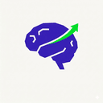
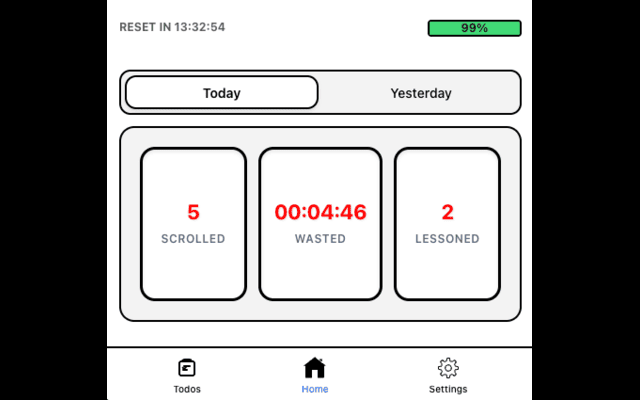
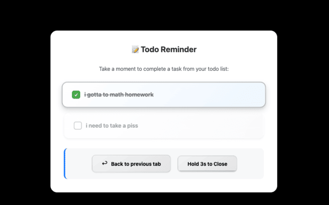
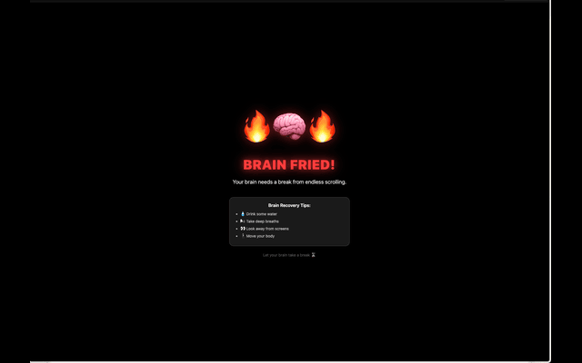

<div align="center">
  

  <h1>YourSelfLearning</h1>

  <p><strong>Stop frying your brain. Get back to yourself.</strong></p>
  <p>Turn doomscrolling into deliberate learning moments tailored to your interests.</p>

  <p>
    <a href="https://chromewebstore.google.com/detail/yourselflearning/nobnpfkpkaiohfaokoihmlcodniimppg">
      
    </a>
  </p>

  <p>
    <a href="#features"></a>
    <a href="#getting-started"></a>
    <a href="#development"></a>
  </p>
</div>

---

## 📸 At a Glance

YourSelfLearning intervenes when you doomscroll, offering bite-sized lessons to recharge your mind.

| **Track Your Habits** | **Learn Interactively** | **Visualize Progress** |
| :---: | :---: | :---: |
|  |  |  |
| Monitor your scroll momentum and time spent on social sites. | Replace mindless scrolling with engaging quizzes and lessons. | See your "Brain Battery" recharge as you learn. |

---

## <a id="features"></a>✨ Key Features

- **🛡️ Interventions That Adapt**: Smart scrolling detection interrupts doomscrolling on TikTok, Instagram, YouTube Shorts, and X (Twitter).
- **🧠 Brain Battery**: A gamified energy meter that drains with scrolling and recharges with learning.
- **📊 Insightful Metrics**: Compare "Today vs. Yesterday" to see real behavior change.
- **🎨 Personalized Learning**: Choose themes like Science, Language, or Philosophy.
- **🔒 Privacy First**: All data is stored locally on your device. No external tracking.

---

## <a id="getting-started"></a>🚀 Getting Started

### Installation

1.  **Clone the repo**
    ```bash
    git clone https://github.com/andyko/YourSelfLearning.git
    cd YourSelfLearning
    npm install
    ```

2.  **Run in Dev Mode**
    ```bash
    npm run dev
    ```
    This launches the extension in Chrome with hot reloading.

3.  **Build for Production**
    ```bash
    npm run build
    ```
    Load the `dist/chrome-mv3` folder in `chrome://extensions` (Developer Mode).

---

## <a id="development"></a>🛠️ Tech Stack

- **Framework**: [WXT](https://wxt.dev/) + Vite
- **UI**: React + TypeScript + Tailwind CSS (via inline styles/modules)
- **Storage**: Chrome `storage.local` with unified state management
- **Testing**: Playwright for end-to-end flows

---

<div align="center">
  <p><strong>Made for curious minds.</strong></p>
  <p>
    <a href="LICENSE">License</a> · 
    <a href="PRIVACY_POLICY.md">Privacy Policy</a>
  </p>
</div>
